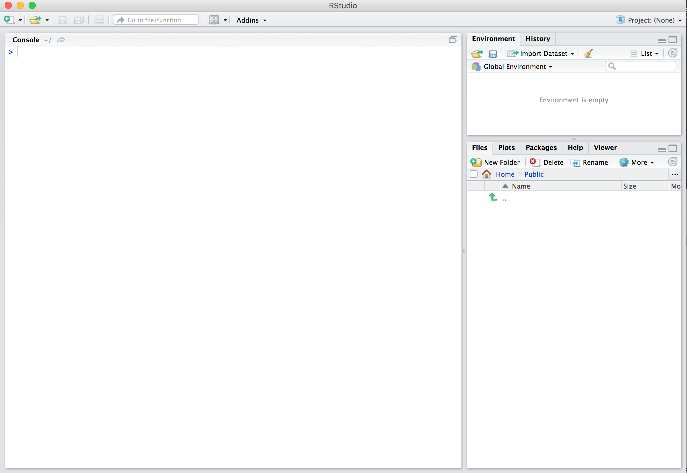

# Introducción {#intro}

## Data Science

La Ciencia de Datos está de moda, eso es un hecho a nivel mundial, ¿pero cuántos realmente conocen qué significa? Hablar de Data Science en estas épocas es como hablar de sexo en la adolescencia, muchos dirán que ya saben, otros dirán que ya lo habrán hecho, pero realmente pocos saben de lo que están hablando. Lo mismo sucede con otros términos relacionado a la Ciencia de Datos como *machine learning* o *big data*.

Comencemos entonces por definir la Ciencia de Datos. Es la disciplina que convierte la data en bruto (*raw data*) en conocimiento, entendimiento y en herramientas para comunicar. Para lograr ello, se necesita 3  habilidades de acuerdo al diagrama de Venn elaborado por Drew Conway: Conocimiento de Experto, Estadística y Métodos de hacking; este último lo podemos definir como la capacidad de resolver problemas con la data en bruto para convertirlo en data en limpio (tidy data). Dado la gran cantidad de  datos que existe en internet y en  datos no estructurados,  la habilidad del hacking se vuelve una habilidad   particularmente importante en estos días.

Hace 50 años, John Tukey llamó a una reforma académica en estadística, a través de uno de los más importantes papers de esa época, llamado “The Future of Data Analysis”, donde señalaba la necesidad futura de una ciencia cuyo interés sea aprender de la data o análisis de datos. Hace unos 20 a 10 años, John Chamber, Jeff Wu, Bill Cleveland y Leo Breiman, dieron una serie de argumentos, de forma independiente sobre expandir los límites de la estadística teórica: Chambers enfatizaba la importancia de la preparación de datos, más que el modelaje estadístico; Breiman, prefería enfatizar la predicción antes que la inferencia; y Cleveland y Wu sugerían llamar a este nuevo campo Data Science por su estrecha relación a la data.

Y fue así estimado lector, donde emerge un fenómeno: se abre paso a los programas de Data Science en las principales universidades del mundo: Berkeley, MIT, NYU, Michigan, Yale, y un gran etcétera.

¿Y qué retos enfrenta la Ciencia de Datos al día de hoy? Los retos de esta disciplina son diversos; sin embargo, a mi opinión, se centraría principalmente en el reto de comunicar de forma ética los avances de las ciencias y/o disciplinas de forma amigable a los usuarios en todo el mundo. Un mundo con mejor utilización de datos de forma ética, podría transformar al mundo a un mundo mejor… Para finalizar, como diría el tío Ben y Roosevelt: “Un gran poder, conlleva a una gran responsabilidad”. (Nota aclaratoria: Roosevelt fue el primero en decir esa frase; sin embargo, se popularizó con Spiderman).

## R y RStudio

&nbsp;&nbsp;&nbsp;&nbsp;&nbsp;

Antes de iniciar debemos entender la diferencia entre R y RStudio. R es un lenguaje de programación con lo que corremos nuestros códigos (incluido este libro), mientras RStudio es un IDE (*integrated development environment*), el cual provee una interface para hacer más amigable programar en R e integrarlo con otras herramientas adicionales (git, github, python, C, etc.).

R: Motor            |  RStudio: Interface 
:-------------------------:|:-------------------------:
{ height=1.7in }  |  { height=1.7in }

### Instalación de R y RStudio

Para instalar primero necesitas descargar R y RStudio en tu laptop o desktop. 

1. [Descarga R](https://cran.r-project.org/).
    + Nota: Esto debes hacer primero.
    + Elige tu versión de acuerdo a tu sistema operativo.
1. [Descarga RStudio](https://www.rstudio.com/products/rstudio/download/#download).
    + Elige tu versión de acuerdo a tu sistema operativo.

### Usando R con RStudio 

¿Se acuerdan de nuestra analogía señalada más arriba? Nosotros no interactuamos directamente con el motor cuando queremos utilizar un carro. Nosotros interactuamos y damos órdenes a través de la interface del vehículo, por lo que siempre estaremos utilizando RStudio. Para que quede claro:

R: No abrir el motor          |  RStudio: Usar la interface
:-------------------------:|:-------------------------:
`r include_image("images/Rlogo.png", html_opts = "width=25%")`  | `r include_image("images/RStudio-Ball.png", html_opts = "width=20%")`

Después de abrir la interface (RStudio), deberías visualizar esto:

## Git y Github

Aparte de elegir el software con el cual trabajar Data Science, en nuestro caso R, hay otras elecciones muy importantes que elegir: (1) el sistema de control de versiones y (2) el servicio de alojamiento del sistema de control de versiones.

Para los simples mortales, ¿Qué son ambos? Comencemos con un ejemplo. ¿Alguna vez han trabajado una macro, script o incluso una tesis, han realizado cambios y han querido regresar a la versión anterior? Podría apostar, casi sin temor a equivocarme, que han trabajado los clásicos “Versión 1”, “Versión 2”, “Versión Final” “Versión Final ésta es”, y así sucesivamente… para no perder una versión anterior. Pensado en ello, se desarrolló los sistemas para controlar versiones, un tema crítico, en especial si manejamos cientos o miles de líneas scripts y no sabes por cual error no está funcionando tu proyecto, en la nueva versión en que estás trabajando y quieres regresar a la versión estable anterior.

Uno de los sistemas más utilizados en el mundo es Git, (que es distinto a Github) que tocaremos en breve… ¿Qué otros sistemas hay? Subversion, SourceSafe, TortoiseSVN, etc. Cada uno con sus pro y contra.

¿Entonces qué es Github? Github es el servicio de alojamiento más popular del sistema Git. ¿En cristiano qué significa? Es aquello que nos permite facilitar Git y trabajar nuestros proyectos de Data Science para evitar los clásicos Versión 1, Versión final, Versión final final, etc. Y Github no sólo es eso, sino una especie de red social de desarrolladores/empresas, donde éstos se conocen, trabajan proyectos en conjunto y se venden profesionalmente…

Github es utilizado en el mundo para alojar diversos proyectos libres de Data Science y, en caso de querer mantener proyectos privados, se paga (es aquí donde funciona su modelo de negocio). 

Para usar la analogía: R a RStudio como Git a Github... Uno puede usar otro IDE como RStudio así como uno puede manejar otro empresa de servicios diferente a Github, pero RStudio y Github son los más populares. 
